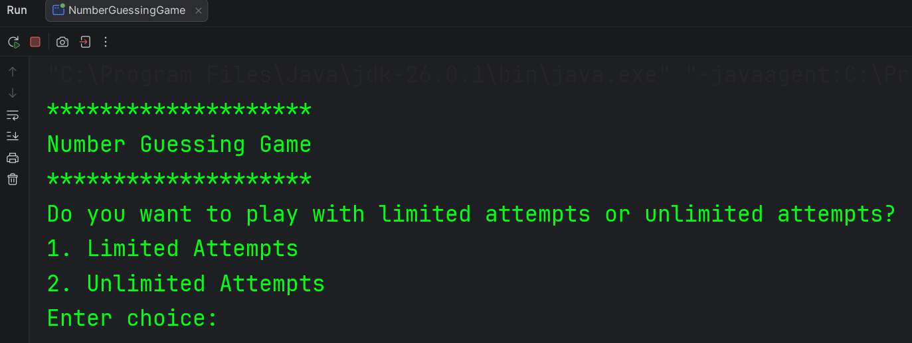
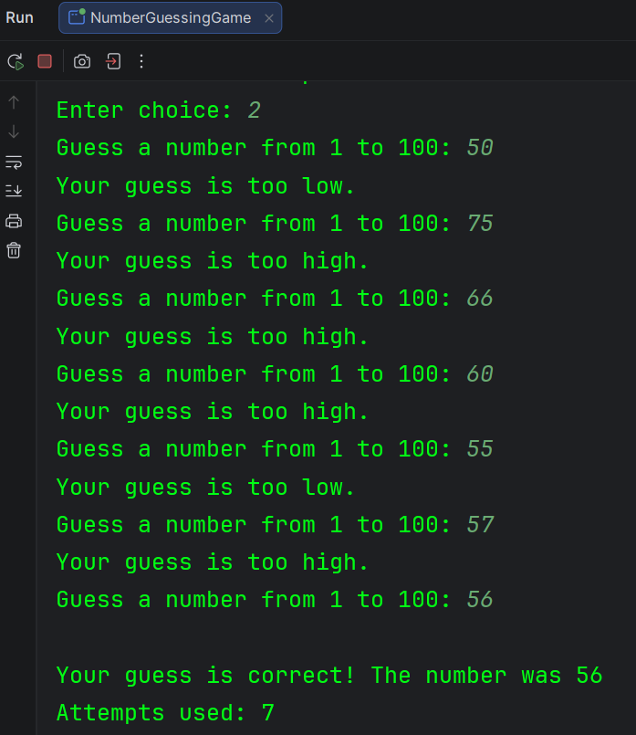
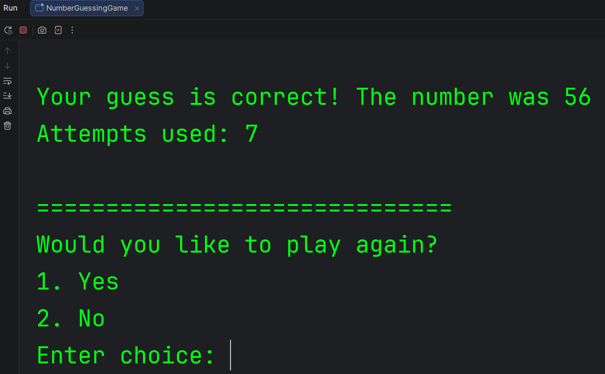

# 🎯 Number Guessing Game

A simple console-based Number Guessing Game built using **Java**. The game generates a random number between **1 and 100**, and the player must guess it using either **Limited Attempts** or **Unlimited Attempts** mode.

This project was built to strengthen my understanding of Java fundamentals, including loops, conditional statements, user input, random number generation, and game logic.

---

## ✨ Features

- 🎲 Random number generation between **1 and 100**
- 🎮 Two game modes:
    - Limited Attempts
    - Unlimited Attempts
- 💡 Hints after every incorrect guess
    - Too High
    - Too Low
- 📊 Displays the total number of attempts used
- ✅ Input validation for user choices
- 🔄 Play Again option

---

## 🛠️ Technologies Used

- Java
- IntelliJ IDEA
- Scanner
- Random

---

## 📂 Project Structure

```text
number-guessing-game
│
├── screenshots
│   ├── interface.png
│   ├── menu.png
│   └── playagain.png
│
├── src
│   └── NumberGuessingGame.java
│
└── README.md
```

---

## 🚀 Getting Started

### Clone the repository

```bash
git clone https://github.com/poojaryaryan/number-guessing-game.git
```

### Run the project

1. Open the project in IntelliJ IDEA (or any Java IDE).
2. Compile and run `NumberGuessingGame.java`.

---

## 📸 Screenshots

### Main Menu



### Gameplay



### Play Again



---

## 👨‍💻 Author

**Aryan Poojary**

- GitHub: https://github.com/poojaryaryan