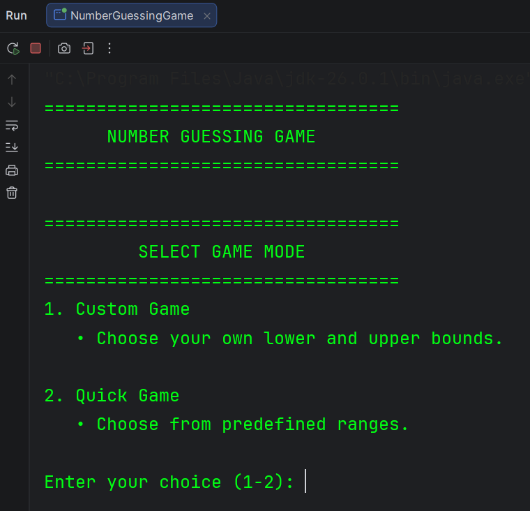
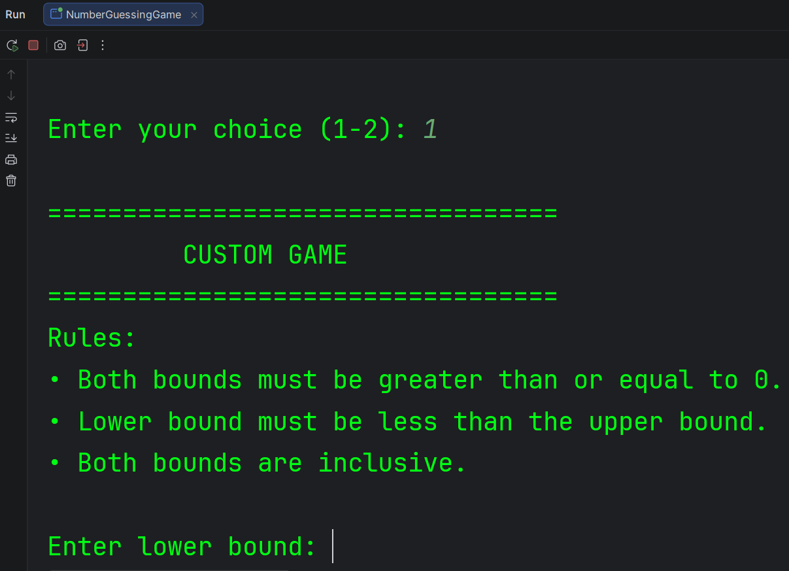
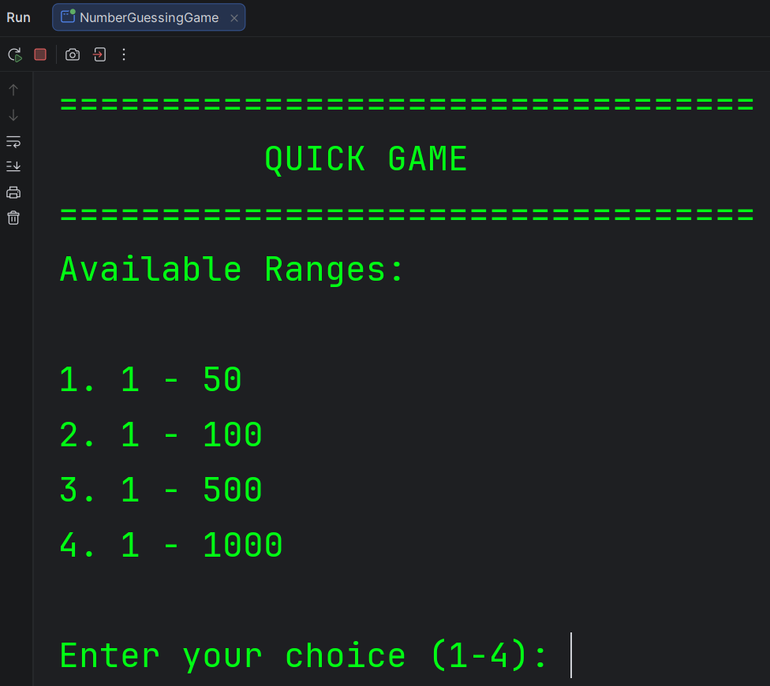
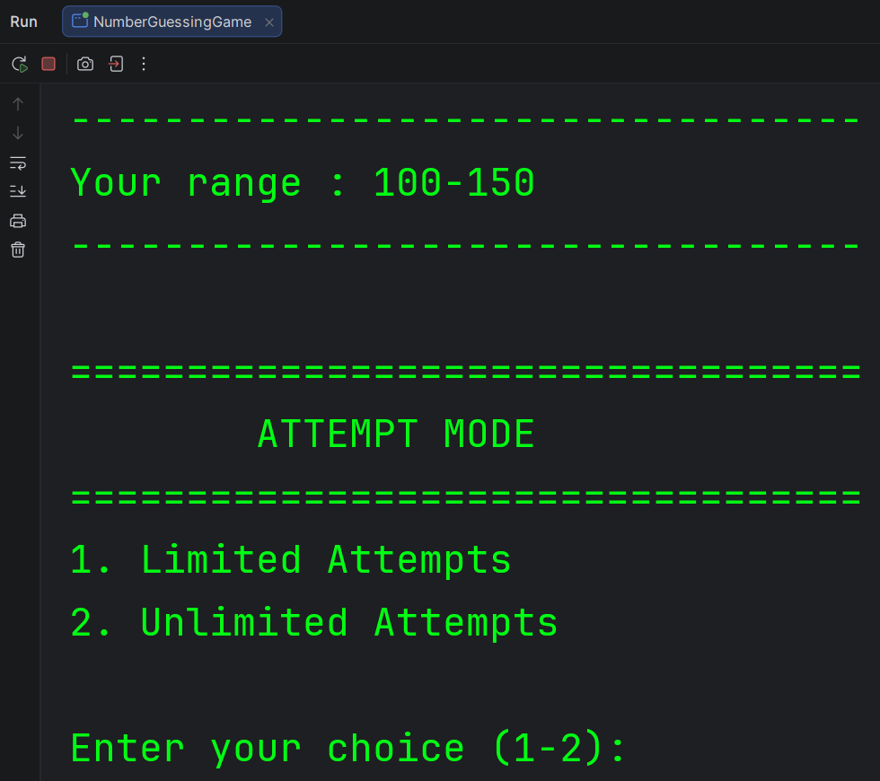
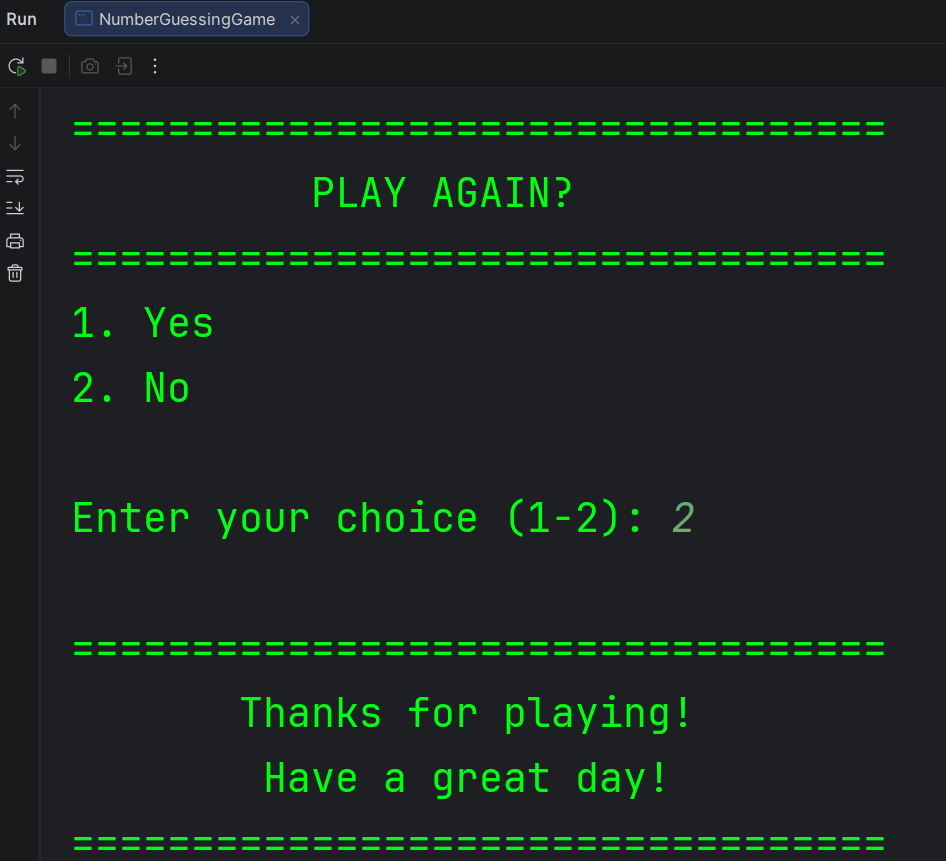
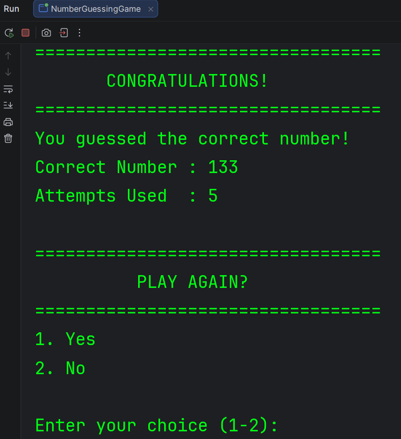

# 🎯 Number Guessing Game

A console-based **Number Guessing Game** built using **Java**. Choose between **Custom Game** (set your own lower and upper bounds) or **Quick Game** (select from predefined ranges), then play using either **Limited Attempts** or **Unlimited Attempts** mode.

This project was built to strengthen my understanding of Java fundamentals, including loops, conditional statements, user input, random number generation, methods, and game logic.

---

## ✨ Features

- 🎮 Two game modes
  - **Custom Game** – Choose your own lower and upper bounds.
  - **Quick Game** – Select from predefined ranges.
- 🎯 Two attempt modes
  - **Limited Attempts**
  - **Unlimited Attempts**
- 🎲 Random number generation within the selected range.
- 💡 Hints after every incorrect guess.
  - Too High
  - Too Low
- 📊 Displays the total number of attempts used.
- ✅ Input validation for menu choices and range selection.
- 🔄 Play Again option.

---

## 🛠️ Technologies Used

- Java
- IntelliJ IDEA
- Scanner
- Random

---

## 📂 Project Structure

```text
number-guessing-game
│
├── screenshots
│   ├── gameinterface.png
│   ├── customgameui.png
│   ├── quickgameui.png
│   ├── attemptmodeui.png
│   ├── gameover.png
│   └── playagainui.png
│
├── src
│   └── NumberGuessingGame.java
│
└── README.md
```

---

## 🚀 Getting Started

### Clone the repository

```bash
git clone https://github.com/poojaryaryan/number-guessing-game.git
```

### Run the project

1. Open the project in **IntelliJ IDEA** (or any Java IDE).
2. Compile and run `NumberGuessingGame.java`.

---

## 📸 Screenshots

<table>
<tr>
<td align="center">
<b>🏠 Main Menu</b><br><br>

</td>

<td align="center">
<b>🎮 Custom Game</b><br><br>

</td>
</tr>

<tr>
<td align="center">
<b>⚡ Quick Game</b><br><br>

</td>

<td align="center">
<b>🎯 Attempt Mode</b><br><br>

</td>
</tr>

<tr>
<td align="center">
<b>🕹️ Game Over</b><br><br>

</td>

<td align="center">
<b>🔄 Play Again</b><br><br>

</td>
</tr>
</table>

---

## 👨‍💻 Author

**Aryan Poojary**

- GitHub: [@poojaryaryan](https://github.com/poojaryaryan)